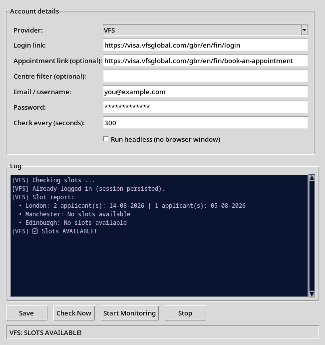

# Visa Slot Checker

A desktop app that watches **VFS Global**, **TLS Contact** and **BLS International**
booking sites and alerts you the moment an appointment slot opens up.

No more refreshing the page every few minutes — fill in your details once, press
**Start Monitoring**, and get a pop-up the second a slot becomes available.



---

## Features

- **3 providers in one app** — VFS Global, TLS Contact and BLS International.
- **Your own links** — enter the exact login link for the account you created on
  each site (the app is not hard-coded to a single country/centre).
- **Check all centres/countries at once** — on VFS, every centre in the dropdown is
  checked and the report lists each one's earliest available slot.
- **One-off check** (`Check Now`) and **continuous monitoring** (`Start Monitoring`)
  with a configurable check interval.
- **Instant alert** — a pop-up window appears when slots are found.
- **Session persistence** — your login session (cookies) is saved to disk, so you
  only have to complete login (including the email **OTP**) **once**.
- **CAPTCHA handling** — uses a 2Captcha API key if you provide one, otherwise falls
  back to local OCR.
- **Headless mode** — run silently in the background without a browser window.
- **Settings remembered** — credentials, links and options are stored per provider in
  `gui_config.json`, so you don't re-enter them every time.
- **Live log + status bar** so you always know what the app is doing.

---

## Requirements

- Python 3.9+
- Google Chrome (or Chromium) installed
- `tesseract-ocr` for local VFS CAPTCHA OCR (recommended)

### Install on Debian / Ubuntu

```bash
sudo apt update
sudo apt install python3 python3-pip python3-tk tesseract-ocr google-chrome-stable
pip install -r requirements.txt
```

### Install on Windows / macOS

1. Install [Python](https://www.python.org/downloads/) and
   [Google Chrome](https://www.google.com/chrome/).
2. Install Tesseract from <https://github.com/tesseract-ocr/tesseract>
   (Windows: run the installer; macOS: `brew install tesseract`).
3. Open a terminal in this folder and run:

```bash
pip install -r requirements.txt
```

> `requirements.txt`:
> `seleniumbase`, `selenium`, `webdriver-manager`, `python-dotenv`,
> `pytesseract`, `Pillow`, `opencv-python`, `numpy`

---

## Quick Start

```bash
python main.py
```

That's it — the app window opens.

---

## Step-by-step usage

### 1. Choose your provider

Use the **Provider** dropdown to pick **VFS**, **TLS** or **BLS**.

### 2. Enter the login link

Paste the **Login link** for the account you created on that site.

Examples:

| Provider | Example login link |
| --- | --- |
| VFS Global | `https://visa.vfsglobal.com/gbr/en/fin/login` |
| TLS Contact | `https://visas-fr.tlscontact.com/en-us/login` |
| BLS International | `https://www.blsinternational.com/` |

> The link must be the actual login page of **your** account/country, because that
> is what the scraper opens and logs into.

### 3. (VFS only) Optional fields

- **Appointment link** — the direct booking page, e.g.
  `https://visa.vfsglobal.com/gbr/en/fin/book-an-appointment`.
  If left empty the app tries to find the booking link automatically after login.
- **Centre filter** — only check a specific centre (e.g. `London`). Leave empty to
  check **all** centres.

### 4. Enter your credentials

Fill in the **Email / username** and **Password** for that site.

> These are only stored locally in `gui_config.json`. Don't share the file.

### 5. Set the check interval

**Check every (seconds)** controls how often monitoring re-checks the site.
A sensible value is `300` (every 5 minutes). The minimum is 5 seconds.

### 6. Optional: run headless

Tick **Run headless** to hide the browser window during checks. Useful for long
monitoring sessions. Leave it off the first time so you can complete login/OTP.

### 7. Start

- **Check Now** — runs a single check and shows the result in the log.
- **Start Monitoring** — checks repeatedly on the interval and **pops up an alert**
  when slots are available.
- **Stop** — stops the monitoring loop.
- **Save** — saves the current settings to `gui_config.json`.

When slots are found you'll see something like:

```
[VFS] Slot report:
  • London: 2 applicant(s): 14-08-2026 | 1 applicant(s): 05-08-2026
  • Manchester: No slots available
  • Edinburgh: No slots available
[VFS] ✅ Slots AVAILABLE!
```

...and an alert pop-up appears.

---

## First-time login and the email OTP (VFS)

VFS sometimes sends a one-time password (OTP) to your email after sign-in.

- Keep **Run headless** **unchecked** on the first run.
- When the OTP page appears, the log says:
  `OTP verification required. Enter the code in the browser window`.
- Type the code into the open Chrome window.
- After you're logged in, the app **saves the session** to `profiles/`.
- On later runs the app reuses that session and skips login + OTP entirely.

> If the saved session expires (VFS usually keeps you logged in for a while), run
> the app once with the browser visible and complete the OTP again.

---

## How the slot checking works

1. The app opens Chrome (UC mode, which also handles Cloudflare challenges).
2. It loads your saved session, or logs in with your credentials
   (solving the CAPTCHA if needed).
3. It navigates to the booking page.
4. **VFS:** it loops through every centre in the dropdown and reads the
   "Earliest available slot" for each. **TLS/BLS:** it inspects the page for
   availability wording.
5. The result is logged, and if any slots exist, a pop-up alert fires.
6. The session is saved again so the next check is fast.

All checks run in a background thread, so the interface stays responsive.

---

## Files

| File | Purpose |
| --- | --- |
| `main.py` | Launches the GUI. |
| `gui.py` | The desktop app (tkinter). |
| `scrapers/` | The scraper logic for VFS, TLS and BLS (`vfs.py`, `tls.py`, `bls.py`, `base.py`). |
| `config.py` | Loads `.env` values used by the scrapers. |
| `text_check.py` | CLI testing tool (see below). |
| `gui_config.json` | Your per-provider settings (created on first save). |
| `profiles/` | Saved login sessions (cookies), one file per provider. |
| `.env` | Optional CAPTCHA key + defaults for CLI testing. |
| `screenshots/` | Documentation images. |

---

## CLI testing (optional)

You can test a single provider from the terminal without opening the GUI.
Credentials/links come from `.env`.

```bash
python text_check.py vfs
python text_check.py tls
python text_check.py bls
# or check every configured provider:
python text_check.py
```

---

## Configuration

### `.env`

```bash
# Optional: 2Captcha API key to solve the VFS image CAPTCHA reliably.
CAPTCHA_API_KEY=

# Where login sessions are stored.
PROFILE_DIR=profiles

# Defaults for text_check.py CLI testing.
VFS_USERNAME=...
VFS_PASSWORD=...
VFS_URL=...
VFS_APPOINTMENT_URL=
TLS_USERNAME=...
TLS_PASSWORD=...
TLS_URL=...
BLS_USERNAME=...
BLS_PASSWORD=...
BLS_URL=...

# Headless mode for CLI tests.
HEADLESS=false
```

### `gui_config.json`

Created automatically when you press **Save**. Stores, per provider:
login link, appointment link, centre filter, username, password, check
interval and headless flag.

---

## Troubleshooting

- **Chrome crashes / "invalid session id"** — update Chrome and rerun
  `pip install -r requirements.txt`. If you're in a container or running as root,
  you may need to launch with `--no-sandbox`.
- **Login link required** — the app refuses to run without a login link.
- **CAPTCHA can't be solved** — set a `CAPTCHA_API_KEY` (2Captcha) in `.env`;
  local OCR works but is less reliable.
- **OTP keeps appearing every run** — the saved session may have expired.
  Run once with the browser visible, enter the OTP, and it will be saved again.
- **No slots reported but you can see them in a browser** — try setting the
  **Appointment link** explicitly, and make sure the centre names in the
  dropdown match what you expect.

---

## Security note

- Passwords are stored in plain text in `gui_config.json` and saved sessions in
  `profiles/`. Keep your computer and these files private; don't commit
  `gui_config.json`, `.env` or `profiles/` to any repository (they are already
  git-ignored).

---

*Built for personal use — scraping public booking sites can violate their terms of
service. Use responsibly and at your own risk.*
